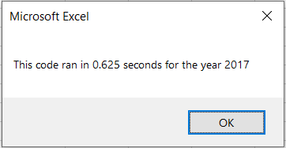
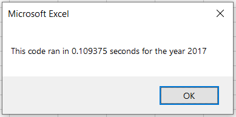
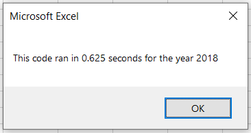
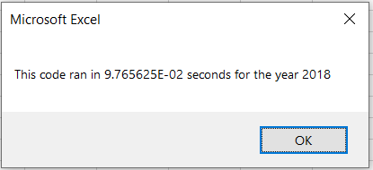

# stock-analysis

## Overview of the project

The objective of this project was to help Steve analyze large stock market datasets with relative ease by using macros. 

For this specific challenge, we are refactoring code written from earlier parts of the analysis to make it more efficient and run faster. 

## Results

The results can be divided into two specific areas: stock performance and code performance

### Stock Performance

There is a clear distinction in stock performance between the years 2017 and 2018.

As we can see from the above images, the year 2017 was a very good year in terms of returns on stock value. Only one stock of twelve stocks analyzed had negative returns and some stocks enjoyed returns higher than 100%.

The year 2018, however was quite the opposite. Most of the stocks performed poorly. Only two of the twelve stocks analyzed had positive returns.

### Code Performance

In terms of the code performance, the refactored code had run times that were much quicker than the original code. With increasing dataset set, this difference would keep getting more significant.

## Summary
