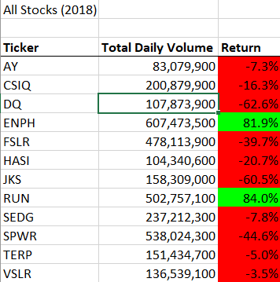

# stock-analysis

## Overview of the project

The objective of this project was to help Steve analyze large stock market datasets with relative ease by using macros. 

For this specific challenge, we are refactoring code written from earlier parts of the analysis to make it more efficient and run faster. 

## Results

The results can be divided into two specific areas: stock performance and code performance

### Stock Performance

There is a clear distinction in stock performance between the years 2017 and 2018.

## Summary
